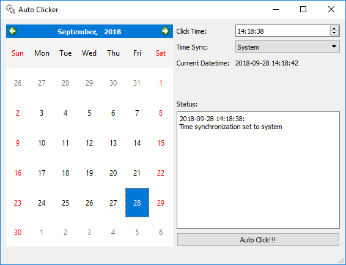

# Auto_Clicker

A GUI auto mouse clicker with Qt5

 

## Usage
1. Set the desired clicking datetime with the calender and time edit widget.
2. Change time synchronization method to the one you like. (optional)
2. Press `Auto Click!!!`.
3. Move the mouse to the place you want to click at the desired time.

## Compile from source
Package requirement:
- Qt5
- CMake
- MSVC 2015 (Windows)

## Binary
Pre-built binary for Windows can be downloaded [here](https://github.com/jackyko1991/Auto_Clicker/releases).

## Acknowledgment
This software is inspired by the [CUHK course registration tool](https://www.facebook.com/CUHKSecrets/photos/a.383493881754733/1023149624455819/?type=1&theater).